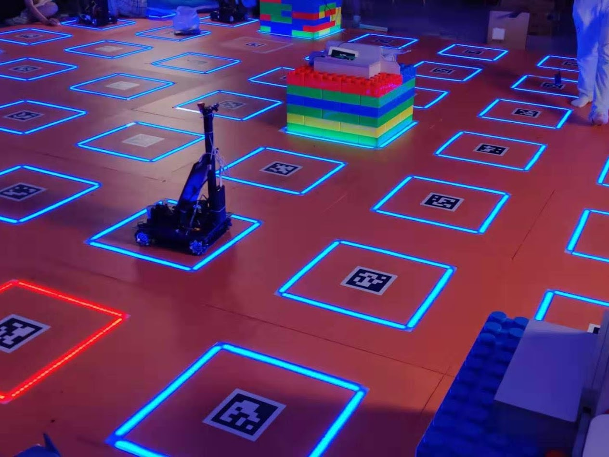
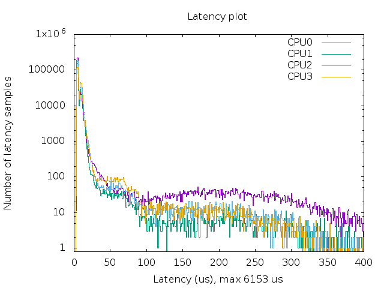
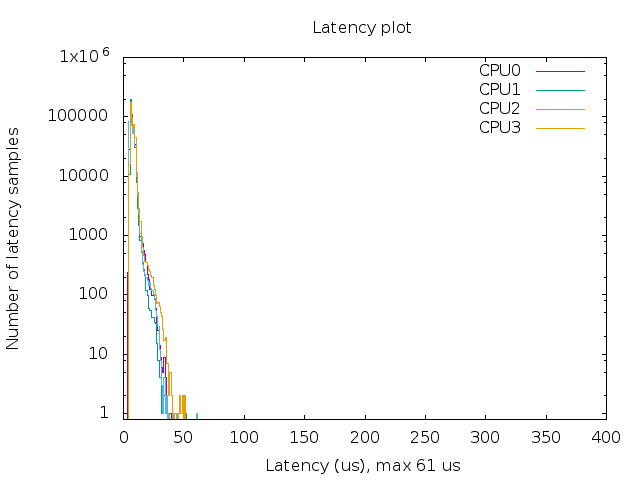
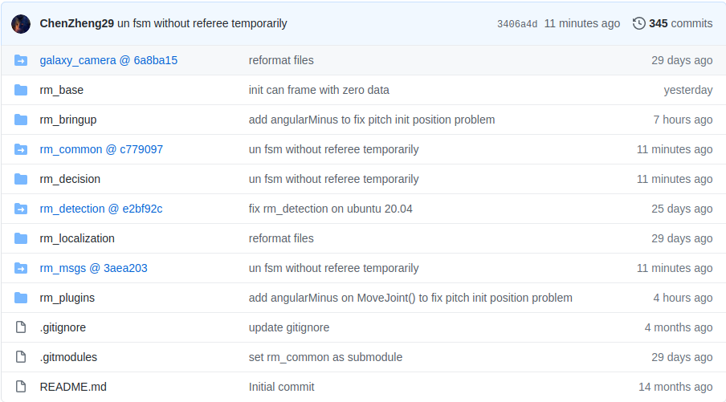
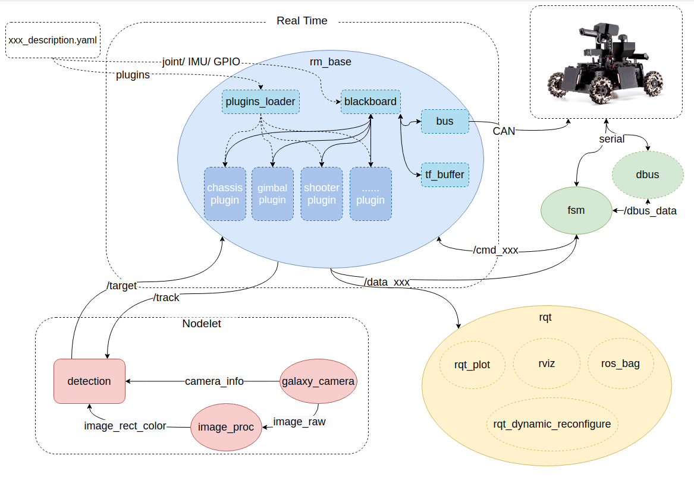
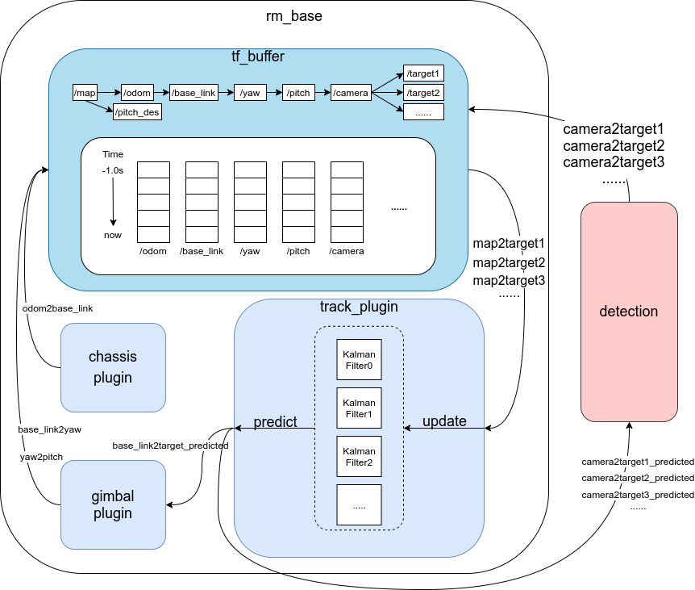

<!--  -->
# <!--fit--> **基于Linux与ROS的无单片机电控**

广东工业大学 DynamicX 机器人队 队长
廖洽源
liaoqiayuan@gmail.com

---

# 目录

- 动机、背景与目标
- 实现
    - 实时性
    - rm_base
    - rm_plugin
    - 开发流程
- 步兵机器人实例
- Demo

---
# 动机、背景与目标

<span style="color:gray;">
<font color=black>

- 动机、背景与目标
</font>

- 实现
  - 硬件方案
  - 软件堆栈
  - 开发流程
- 步兵机器人实例
- Demo

</span>

---
<!--
_header: '**动机**'
-->

## 举手✋
<!-- 相信现在有不少电控组的成员，不知道大家有没有遇到过电控开发时的效率、兼容性稳定性问题，如果有的话请举一下手可以嘛 -->

<!-- 大家可以看到这些问题是普遍存在的，那么怎么解决这些问题呢？
让我们看看近年来先进的机器人的电控方案是怎么样的？ -->
曾经觉得...
- 使用 keil 开发很难受
- 经常重复编写和维护功能类似的机器人代码
- 与算法组上位机接口不稳定
- 难以移植其他平台的算法库
- 单片机算力不足
- 电控系统结构复杂

✋✋✋✋✋✋✋✋✋✋✋✋✋✋✋✋✋✋✋✋

---
<!--
_class: lead
_backgroundImage: 
_header: '**背景**'
-->
## ANYmal

- 开发于：2017年
- 总线： CAN / EtherCAT
- 主控：Intel NUC


---
## <!--fit-->  MIT Cheetah 3/Mini
<!--
_class: lead
_backgroundImage: 
_header: '**背景**'
-->

- 开发于：2018年
- 总线： CAN
- 主控：UPboard
  


---
## 妙算控车
<!--
_class: lead
_backgroundImage: 
_header: '**背景**'
-->

- 开发于：2019年高中生夏令营
- 总线： CAN
- 全自动
- 主控：妙算2




---
<!--
_class: lead
_header: '**背景**'
-->
### 比赛全自动运行视频 

<video  src="./assets/IMG_0149.TRIM.MOV" controls width="100%">
</video>

---
<!--
_class: lead
_header: '**背景**'
-->
### <!--fit--> 🔪 砍掉单片机
<!-- 所以， 解决方案是！砍掉单片机是指， 使用PC作为主控制器，单片机只负责电机FOC驱动等底层驱动设备。 -->

---
## 目标&优势
<span style="font-size:70%">

1. 极其简单的系统结构
    - 不需要编写单片机程序
    - 主控与视觉识别的计算设备相同
2. 极高开发效率
    - 所有电机, 传感器数据均可记录和可视化
    - 所有控制参数均可动态和远程调试
    - 丰富的成熟软件包
3. 兼容性可复用性强
   - 提供三套硬件解决方案
   - 程序模块化, 并通过ROS plugins进行动态加载, 所有机器人共用一套代码
   - 支持 CAN 总线, DBus, UART, GPIO, PWM 等 RM 常用外设
4. 相比单片机而言, 极高的算力

</span>

---
# 实现

<span style="color:gray;">

- 动机、背景与目标
<font color=black>

- 实现
</font>

  - 硬件方案
  - 实时性
  - 软件堆栈
  - 开发流程
- 步兵机器人实例
- Demo

</span>

---
<!--
_header: '**实现**'
-->
# 硬件
根据视觉识别要求：

<span style="font-size:70%">

1. Jetson 系列: 深度学习视觉算法
   - 内置CAN
   - 内置GPIO/SPI/iiC

2. Intel NUC: 传统视觉算法

   - USB转CAN (Candlelight)
   - CAN转GPIO

3. UP Board: 无视觉算法

   - SPI转CAN (MCP2515)
   - 内置GPIO

</span>

---
<!--
_header: '**实现**'
-->
## 实时性
<span style="font-size:70%">

- Linux + [PREEMPT_RT](https://rt.wiki.kernel.org/index.php/Main_Page) 补丁
- UP Board 在 压力下的实时性测试：

</span>


<!-- cyclisttest -->
<center>

 
</center>

---
<!--
_header: '**实现**'
-->
## 软件堆栈

<span style="font-size:70%">
整个软件由多个ROS package组成, 他们运行于 Linux 和 ROS 上。

1. 驱动:
   - 通过描述文件定义机器人的：总线, 执行器, 传感器类型和参数
   - 计算电机位置, 速度等状态，传感器的数据并标准单位化
   - 运行基础控制器（PID + Feedfoward）
   - 向模块提供数据访问接口

2. 模块：
   - 根据机械结构或电控逻辑和功能，对机器人模块化
   - 运行简单的状态机和运动学，动力学算法，计算基础控制器期望
   - 提供 topic、server、action 的ROS接口
3. 决策：
   - 根据遥控和裁判系统等数据向各个模块发送指令
  
</span>

---
<!--
_header: '**软件堆栈**'
-->
### 文件结构

<center>


</center>

---
<!--
_header: '**软件堆栈**'
-->
### 节点图
<center>



</center>

---
<!--
_header: '**实现**'
-->
### 研发流程
1. 队长、组长与负责人确定项目需求;
2. 负责人开新branch;
3. 项目成员在branch进行开发;
4. 对每个重要进行commit;
5. 项目测试和验收;
6. 验收后merge到主分支。


---
<!--
_header: '**步兵机器人实例**'
-->
# 步兵机器人实例

<span style="color:gray;">

- 动机、背景与目标

- 实现

  - 硬件方案
  - 实时性
  - 软件堆栈
  - 开发流程
<font color=black>
- 步兵机器人实例
</font>
- Demo

</span>

---
<!--
_header: '**步兵机器人实例**'
-->
## rm_base

<span style="font-size:70%">

```yaml
joint: 
[
   { name: "wheel_rf", bus: "can0", id: 0x201,
   type: "3508", ctrl: "speed" ,dir: false },
   { name: "wheel_lf", bus: "can0", id: 0x202,
   type: "3508", ctrl: "speed" ,dir: true },
   ....................省略电机......................
   { name: "trigger", bus: "can1", id: 0x203,
   type: "2006", ctrl: "pd" ,dir: true }, 
]
imu:
   { type: "hi220", port: "/dev/usbImu", id: 0, rate: 200,
    frame_fixed: "base_link", frame_source: "odom", frame_target: "base_link" }

plugins:
  - chassis_plugins::Standard
  - gimbal_plugins::Standard
  - shooter_plugins::Standard
  - imu_plugins::Hi220Uart
  - track_plugins::KalmanFilterTrack

```

</span>


---
<!--
_header: '**步兵机器人实例**'
-->
## 云台模块

<span style="font-size:80%">

- 功能:
  - 跟踪模式: 指向期望角度(枪管姿态)
  - 手操模式: 以特定角速度旋转
- 特性:
  - IMU可以装在车体任何位置
  - 在车体任意角度倾斜时保证枪管姿态不变 (忽略roll轴旋转)
- 接口 (topic: /cmd_gimbal):
  - 模式选择
  - 期望抢管速度
  - 期望抢管姿态

</span>

---
<!--
_header: '**步兵机器人实例**'
-->
## 跟踪模块


<span style="font-size:65%">

功能:
  - 估计装甲板位置
  - 预测装甲板位置
  
特性:
  - 考虑云台转动速度
  - 考虑自身车体速度
  
接口:
  - 将预测值给： 
    - 云台模块 (blackboard)
    - 视觉 Node (topic)

</span>

---
# Demo

<span style="color:gray;">

- 动机、背景与目标

- 实现

  - 硬件方案
  - 实时性
  - 软件堆栈
  - 开发流程
- 步兵机器人实例
<font color=black>
- Demo
</font>

</span>

---
<!--
_header: '**Demo**'
-->
## 底盘
<video  src="./assets/chassis.mp4" controls width="100%">
</video>

---
<!--
_header: '**Demo**'
-->
## 云台
<video  src="./assets/gimbal.mp4" controls width="100%">
</video>

---
<!--
_header: '**Demo**'
-->
## 5hz射击
<video  src="./assets/shooter5hz.mp4" controls width="100%">
</video>

---
<!--
_header: '**Demo**'
-->
## 20hz射击
<video  src="./assets/shooter20hz.mp4" controls width="100%">
</video>


---
<!--
_header: '**Demo**'
-->
## 自动飞坡
<video  src="./assets/fly.mp4" controls width="100%">
</video>


---
# RoadMap


<span style="font-size:200%">

- 基于 ros_control 重写
- 更多的稳定性测试
- 开源❤️

</span>


---
# 问答

## <!--fit--> ❓

 
